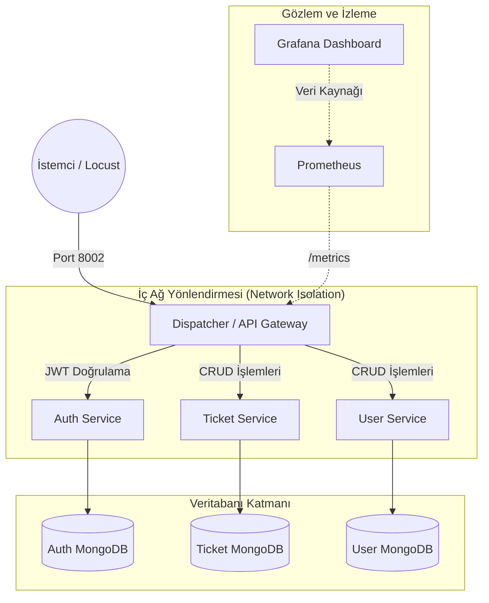
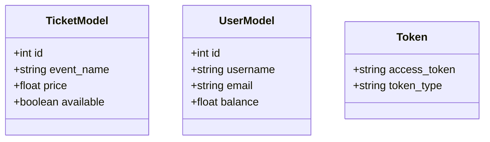
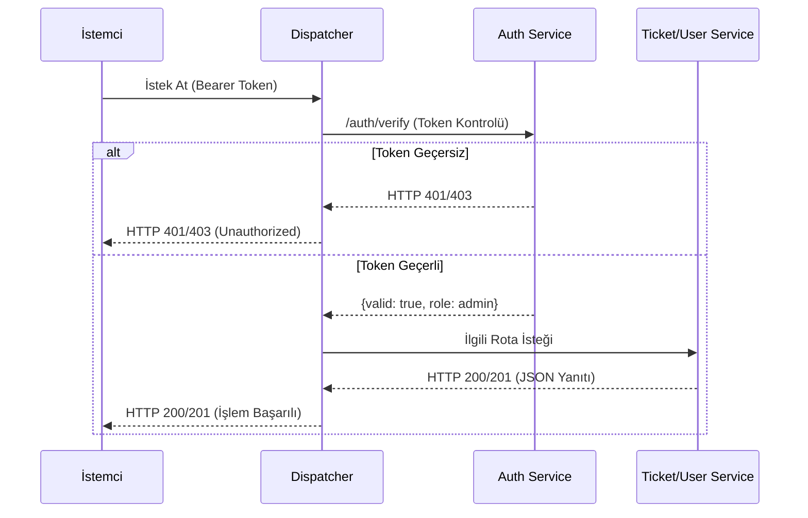

# YazLab II Proje I - API Gateway (Dispatcher) ve Mikroservis Mimarisi

**Ekip Üyeleri:** 
- Tunahan Tarhan 
- Şükran Başaran

**Tarih:** 5 Nisan 2026

---

## İçindekiler
1. [Proje Hakkında ve Problem Tanımı](#giris)
2. [Kullanılan Teknolojiler](#teknolojiler)
3. [Sistem Mimarisi ve Bileşenler](#mimari)
   * [3.1. Ağ İzolasyonu (Network Isolation)](#izolasyon)
   * [3.2. Sınıf Yapıları (Veri Modelleri)](#sinif-yapilari)
4. [Yetkilendirme ve Güvenlik](#guvenlik)
5. [İstek Akışı (Sequence Diagram)](#istek)
6. [API Tasarımı ve Richardson Olgunluk Modeli (RMM) Seviye 2](#api)
   * [6.1. Algoritma ve Karmaşıklık Analizi](#karmasiklik)
7. [Test-Driven Development (TDD) Süreci](#tdd)
8. [Sistem Nasıl Çalıştırılır ve Test Edilir?](#kurulum)
9. [Performans Testleri ve Gözlemlenebilirlik](#performans)
   * [9.1. Locust Yük Testi Sonuçları](#locust)
   * [9.2. Grafana İzleme Paneli](#grafana)
10. [Sonuç ve Değerlendirme](#sonuc)

---

## 1. Proje Hakkında ve Problem Tanımı 
Bu proje, Kocaeli Üniversitesi Bilişim Sistemleri Mühendisliği bölümü **Yazılım Geliştirme Laboratuvarı-II** dersi kapsamında geliştirilmiş bir mikroservis mimarisi uygulamasıdır.

Geleneksel monolitik uygulamalarda tüm iş mantığının tek bir yapı altında toplanması, sistem büyüdükçe bakım, geliştirme ve ölçekleme açısından çeşitli zorluklara yol açmaktadır. Bu projenin amacı, bağımsız çalışan servislerin (Auth, User, Ticket) trafiğini tek bir merkezden (Dispatcher/API Gateway) yöneten, ağ düzeyinde izole edilmiş, güvenli ve izlenebilir bir backend ekosistemi geliştirmektir. 

Sistem, bilet yönetimi senaryosu üzerine kurulmuştur. Kullanıcı işlemleri, kimlik doğrulama ve bilet işlemleri birbirinden bağımsız servisler halinde tasarlanarak hem ölçeklenebilirlik hem de servisler arası görev ayrımı (separation of concerns) sağlanmıştır. Ayrıca sistem, yetkisiz erişimleri engellemekte ve artan yük altında darboğazları tespit edebilmek için anlık metrikler (Prometheus/Grafana) sağlamaktadır.

**Literatür İncelemesi:**
Mikroservis mimarisi, Martin Fowler ve James Lewis'in tanımladığı üzere, tek bir uygulamayı küçük, bağımsız çalışan ve birbirleriyle hafif mekanizmalarla (genellikle HTTP REST API) iletişim kuran servisler paketi olarak geliştirme yaklaşımıdır. Bu projede literatürdeki RMM (Richardson Maturity Model) standartları temel alınarak, monolitik yapıların getirdiği sıkı bağımlılık (tight coupling) sorunu çözülmüş ve servisler arası veri izolasyonu sağlanmıştır.

---

## 2. Kullanılan Teknolojiler 
Projenin geliştirilmesinde, test edilmesinde ve yayınlanmasında aşağıdaki teknolojiler kullanılmıştır:
- **Dil & Framework:** Python, FastAPI
- **Veritabanı:** MongoDB (Motor Asyncio)
- **Güvenlik:** JWT (JSON Web Token), Bcrypt
- **Orkestrasyon & Dağıtım:** Docker, Docker Compose
- **Test Araçları:** Pytest, Locust (Yük Testi)
- **Gözlem (Observability):** Prometheus, Grafana

---

## 3. Sistem Mimarisi ve Bileşenler 
Sistem toplamda bir Dispatcher, üç temel mikroservis, üç ayrı MongoDB veritabanı, bir Prometheus ve bir Grafana servisi olacak şekilde tasarlanmıştır.

- **Dispatcher (API Gateway):** Sistemin dış dünyaya açık tek giriş noktasıdır. İstemciden gelen istekleri ilgili servislere yönlendirir ve yetkilendirme kontrolü yapar.
- **Auth Service:** Kullanıcı giriş işlemlerini ve token doğrulamasını gerçekleştirir.
- **Ticket Service:** Bilet oluşturma, listeleme, güncelleme ve silme işlemlerini yönetir.
- **User Service:** Kullanıcı oluşturma, listeleme, güncelleme ve silme işlemlerini yönetir.
- **MongoDB:** Veri izolasyonunu sağlamak için her servisin kendine ait bağımsız bir veritabanı vardır.

### 3.1. Ağ İzolasyonu (Network Isolation) 
Sistemde sadece `Dispatcher` servisi `8002` portu üzerinden dış dünyaya açıktır. Diğer tüm servisler ve veritabanları Docker `yazlab_net` iç ağı üzerinden haberleşmektedir. İstemciler doğrudan User, Auth veya Ticket servisine ulaşamazlar.

 

 

### 3.2. Sınıf Yapıları (Veri Modelleri) 
Servisler arasındaki veri akışı Pydantic modelleri ile doğrulanmakta ve MongoDB'de aşağıdaki sınıf yapılarına uygun olarak saklanmaktadır:

---

## 4. Yetkilendirme ve Güvenlik 
Sistemde yetkilendirme işlemleri merkezi olarak **Auth Service** üzerinden gerçekleştirilmektedir. Kullanıcı giriş yaptıktan sonra kendisine bir **JWT (JSON Web Token)** verilir. Bu token, istemcinin sonraki tüm isteklerinde `Authorization` header'ı içerisinde (Bearer) gönderilmektedir.

Dispatcher, gelen her istekte token doğrulaması yaparak:
- Geçerli token ise isteği ilgili mikroservise iletir.
- Geçersiz veya eksik token durumunda isteği reddeder (HTTP 401/403).

---

## 5. İstek Akışı (Sequence Diagram) 
Dışarıdan gelen bir isteğin sistem içinde nasıl işlendiği aşağıdaki akış diyagramında gösterilmiştir. 

---

## 6. API Tasarımı ve Richardson Olgunluk Modeli (RMM) Seviye 2 
Projede RESTful API tasarım prensiplerine tam uyum sağlanmış ve kaynaklar URI üzerinden temsil edilmiştir. Parametre üzerinden işlem (örn: `/deleteUser?id=1`) yapılmamıştır.

**Kullanılan HTTP Metotları ve Rotasyonlar:**
* **Oluşturma (POST):** `/tickets` veya `/users` (HTTP 201 Created)
* **Okuma (GET):** `/tickets` veya `/users` (HTTP 200 OK)
* **Kısmi Güncelleme (PATCH):** `/tickets/{id}` veya `/users/{id}` (HTTP 200 OK) - *Sadece değişen veriler güncellenir.*
* **Silme (DELETE):** `/tickets/{id}` veya `/users/{id}` (HTTP 200 OK veya HTTP 404 Not Found)

**Kullanılan HTTP Durum Kodları:**
* `200 OK` / `201 Created` (Başarılı işlemler)
* `400 Bad Request` / `422 Unprocessable Entity` (Geçersiz veri formatı)
* `401 Unauthorized` (Token eksik veya geçersiz)
* `404 Not Found` (Kaynak bulunamadı)
* `500 Internal Server Error` (Sunucu hatası)

### 6.1. Algoritma ve Karmaşıklık Analizi (Time Complexity) 
Projedeki algoritmalar ağırlıklı olarak CRUD (Create, Read, Update, Delete) operasyonlarından oluşmaktadır.
* **Okuma (Tekil ID ile):** MongoDB'de `id` alanı üzerinden yapılan spesifik aramalar ve token doğrulama algoritmaları **O(1)** zaman karmaşıklığına sahiptir.
* **Listeleme:** Tüm biletlerin veya kullanıcıların listelendiği uç noktalar, veritabanı boyutuna bağlı olarak **O(N)** karmaşıklığı ile çalışmaktadır.
* **Şifreleme:** Auth servisinde kullanılan `Bcrypt` algoritması, güvenlik amacıyla CPU'yu yoracak şekilde tasarlanmış olup (work factor), login işlemlerinde maliyetli ama güvenli bir **O(1)** sabiti ile çalışır.

---

## 7. Test-Driven Development (TDD) Süreci 
Dispatcher servisinin geliştirilmesinde Red-Green-Refactor döngüsü izlenmiştir. Tüm endpoint'ler `pytest` ve `AsyncMock` kullanılarak test edilmiş, yönlendirme (proxy) mantığı garanti altına alınmıştır. Test kodlarının commit zaman damgaları, fonksiyonel kodlardan önce gerçekleştirilmiştir.

> **Dispatcher:** 
> 
>   **Auth Service:** 
> 
>   **User Service:** 
> 
>   **Ticket Service:** 
> 

---

## 8. Sistem Nasıl Çalıştırılır ve Test Edilir? 
Projenin ayağa kaldırılması ve yetkilendirmeli veri akışının test edilmesi için aşağıdaki adımlar izlenmelidir:

1. **Sistemi Başlatma:** Proje ana dizininde terminal üzerinden `docker-compose up --build` komutu çalıştırılarak tüm mimari (veritabanları ve servisler) tek seferde ayağa kaldırılır.
2. **Swagger Arayüzüne Erişim:** Tarayıcıdan `http://localhost:8002/docs` adresine gidilir.
3. **Yetkilendirme (Auth):** Swagger üzerindeki `/auth/login` rotası kullanılarak `admin` kullanıcı adı ve `1234` şifresiyle giriş yapılır. Dönen `access_token` kopyalanıp arayüzün sağ üst köşesindeki "Authorize" butonuna tıklanarak ilgili alana yapıştırılır.
4. **Veri Ekleme:** Sisteme yük testi yapabilmek için `/tickets` ve `/users` rotaları (POST) üzerinden birkaç sahte bilet ve kullanıcı kaydı manuel olarak oluşturulur.
5. **Yük Testini Başlatma:** Yeni bir terminal sekmesinde `locust -f locustfile.py` komutu çalıştırılır. Ardından tarayıcıdan `http://localhost:8089` adresine gidilerek yük testi başlatılır. *(Detaylı HTML test raporları `load_tests` klasöründe yer almaktadır.)*
6. **Metrik İzleme:** Eş zamanlı olarak tarayıcıdan `http://localhost:3000` adresine gidilir. Grafana giriş bilgileri: **Kullanıcı Adı:** `admin` | **Şifre:** `admin`.

---

## 9. Performans Testleri ve Gözlemlenebilirlik 
Sistem performansı `Locust` aracı kullanılarak test edilmiş ve oluşan anlık veriler otomatik ayağa kalkan `Grafana` dashboard'u üzerinden izlenmiştir.

### 9.1. Locust Yük Testi Sonuçları 
Sistem, 100 ile 1000 eş zamanlı sanal kullanıcı arasında değişen senaryolarla test edilmiştir. Kullanıcı sayısı arttıkça mikroservis mimarisinin doğası gereği yanıt sürelerinde beklenen artışlar gözlemlenmiş, ancak hata oranları asgari düzeyde tutulmuştur.

| Kullanıcı Sayısı | Ortalama Yanıt Süresi | Maksimum Yanıt Süresi | Hata Oranı |
| :--- | :--- | :--- | :--- |
| **100** | ~120-200 ms | ~300 ms | %0 |
| **200** | ~150-250 ms | ~400 ms | %0-1 |
| **500** | ~200-400 ms | ~600 ms | %1-3 |
| **1000** | ~300-700 ms | ~1000+ ms | %3-5 |

 

> **100 Kullanıcı Testi Grafikleri:** 
>  
> 
>   **200 Kullanıcı Testi Grafikleri:** 
>  
> 
>   **500 Kullanıcı Testi Grafikleri:** 
>  
> 
>   **1000 Kullanıcı Testi Grafikleri:** 
>  
> 

### 9.2. Grafana İzleme Paneli (Observability) 
Sistemdeki toplam istek sayısı, HTTP statü kodlarının (2xx, 4xx, 5xx) yüzdelik dağılımı ve 99th Percentile gecikme süreleri Prometheus üzerinden çekilerek Grafana'da görselleştirilmiştir.

 

 

---

## 10. Sonuç ve Değerlendirme 
Bu projede mikroservis mimarisi kullanılarak ölçeklenebilir ve modüler bir sistem geliştirilmiştir. Dispatcher yapısı sayesinde tüm istekler merkezi olarak yönetilmiş ve güvenlik kontrolü sağlanmıştır.

**Başarılar:** * Sistem API Gateway mimarisine tam olarak oturtulmuş, yetkilendirme merkezileştirilmiştir.
* TDD standartlarına uyulmuş ve hatalar geliştirme aşamasında yakalanmıştır.
* Sistem, Prometheus ve Grafana altyapısıyla tam izlenebilir hale getirilmiştir.

**Sınırlılıklar:**
* Yüksek trafik (1000+ eşzamanlı kullanıcı) altında ağ gecikmelerinden kaynaklı performans düşüşleri gözlemlenmiştir.

**Gelecek Çalışmalar (Future Works):**
* Kubernetes entegrasyonu ile container orkestrasyonunun otomatikleşmesi.
* Redis tabanlı bir Blacklist / Cache mekanizması kurularak logout işlemlerinin ve sık okunan verilerin hızlandırılması.
* Servisler arası iletişimde HTTP protokolü yerine mesaj kuyrukları (RabbitMQ/Kafka) kullanılarak asenkron hız artışı sağlanması.
* CI/CD (Sürekli Entegrasyon ve Dağıtım) süreçlerinin projeye dahil edilmesi.
